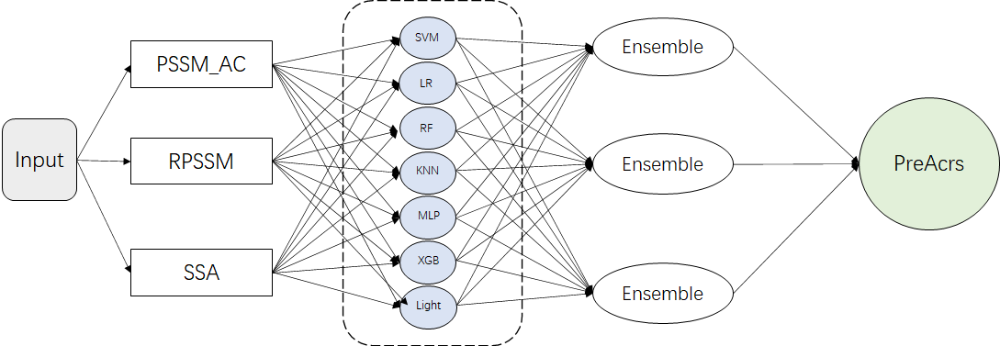
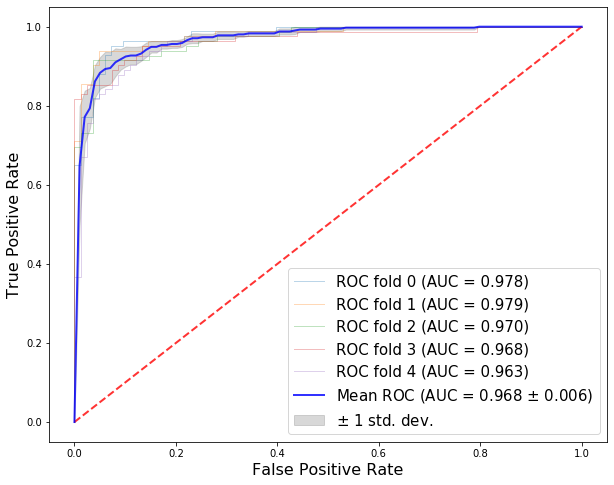
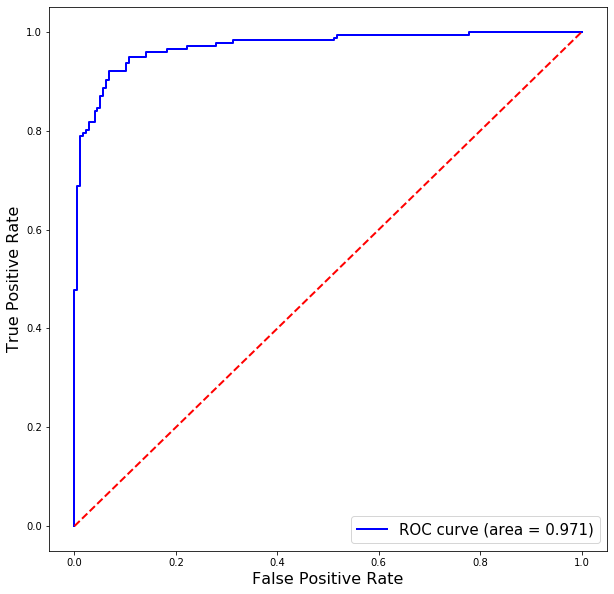

# PreAcrs

PreAcrs: one powerful model to predict anti-CRISPR proteins

## How to use:

### Data preparetion:

After downloading the amino acid sequences of anti-CRISPR proteins and un-anti-CRISPR proteins from NCBI and UniProt, you should extract three features from the below steps before using PreAcrs:you should extract three features from belowing steps before you use PreAcrs.

1. Extracting the PSSM_AC feature and RPSSM feature from an online service named POSSUM [https://possum.erc.monash.edu/server.jsp]()
2. Extracting the SSA feature from a python-based toolkit named eFeature [http://lab.malab.cn/soft/eFeature/index.html](http://lab.malab.cn/soft/eFeature/index.html)

### Architecture

The architecture of the PreAcrs is displayed in the following picture.



### Output

After preparing three features of the training dataset and the testing dataset, Download the code folder.

Read the three features .csv files of the training and testing datasets in the data.py, return train_data and test_data, respectively.

Run PreAcrs.ipynb

The result includes:

Performance evaluation dataframe ‘`validation_perfromance`’ of the training dataset based on the 5-fold cross-validation

```
#metrics ['PRE','SN','SP','F_score','ACC','MCC','AUC']
validation_perfromance=premodel.metrix(y_proba_valid_all,y_verified_valid_all)
validation_perfromance
```

The ROC image of the training dataset based on the  5-fold cross-valion

```
premodel.ROC_5_fold(y_proba_valid_all,y_verified_valid_all)
```



The predicted scores of the testing proteins are saved in the ‘`pred_test`’ dataframe.

```
pred_test=pd.DataFrame({'Predict score':test_pred_score,'Verified':test_data[0].iloc[:,0]}).reset_index(drop=True)
pred_test
```

The performance evaluation form and ROC image of the testing data are showed.

```
test_performance1=premodel.performance(test_pred_score,test_data[0].iloc[:,0])
test_performance=pd.DataFrame(columns=['PRE','SN','SP','F_score','ACC','MCC','AUC'])
test_performance.loc[0]=test_performance1
test_performance
```

```
##ROC image:
premodel.auc_pred(list(test_pred_score),list(test_data[0].iloc[:,0]))
```



# Reference
